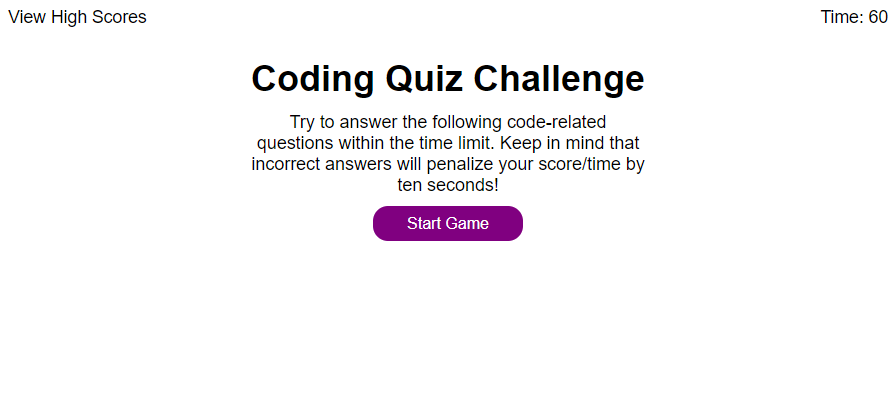

# code-quiz

## Description
This is an interactive quiz with five questions. When you answer wrong time is subtracted and at the end you can save your initials with your score. The website is built with HTML, CSS and JavaScript.
## Table of Contents
- [Installation](#installation)
- [Usage](#usage)
- [How to Contribute](#how-to-contribute)
- [Tests](#tests)
## Installation
N/A
## Usage
Visit the website here: https://markcirineo.github.io/code-quiz/

## How to Contribute
You can contact me here: markcirineo22@gmail.com
## Tests
N/A